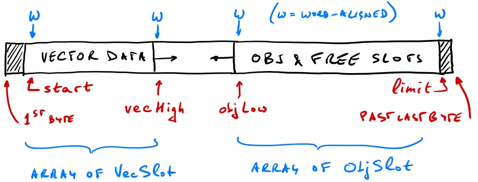
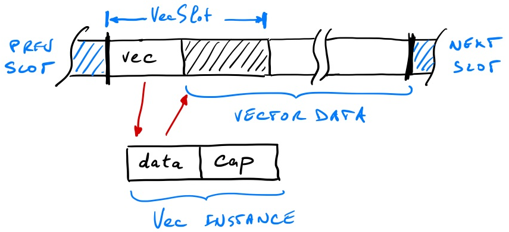

# monty/gc.cpp

The garbage collector (GC) manages [objects and
vectors](arch/objects-and-vectors) . When objects are allocated on the "heap",
they are in fact placed in the global memory pool, managed in this file.

The GC does not _directly_ allocate vectors. Vectors are not objects, but they
may be fields _inside_ objects, and thus have lifetimes associated with their
owner objects.

While it's not strictly part of "GC", this code also contains logic to move
vectors around, in order to reclaim unused space. It does this by iterating over
all vectors, moving them down to remove any gaps.

?> The GC doesn't know about `Value` instances, as these are not involved in
memory allocation.

The code in `gc.cpp` is highly modular: it can be tested in isolation (see
`test/gc/main.cpp`), and could in fact be used without any of the other parts of
Monty, if so desired.

## Mark, sweep, and compact

There are three distinct function groups in this file:

* **Mark** is the traditional first step of mark-and-sweep GC: starting from a
  given set of root objects, mark all the objects which are still referenced.
  This needs a place to store the "mark bit", and for this, the low bit of the
  _first_ word in the object is used. This is always a pointer to the `vtable`,
  used for fetching virtual methods.

  !> Since vtable pointers will be _invalid_ while marked, this means that
  **interrupt code** which runs during GC _may not call any virtual methods_ in
  objects. It's a very severe restriction, but it applies only to hardware
  interrupt handlers, since stacklets use cooperative scheduling.

  Once marking is complete, all (and only) the reachable objects will have their
  mark bit set.

* **Sweep** is the second step in mark-and-sweep GC. It iterates through the
  entire area used by objects. It can do this, because the gaps in between
  objects contain enough information to allow skipping them.

  The sweep will remove the mark bit if set, or free the object if clear. This
  freeing will also trigger the object's C++ _destructor_, and also all the
  destructors of embedded fields and super classes.

  Once the sweep is over, all the remaining objects will be unmarked again,
  ready for normal use.

* **Compact** is an _optional_ third step in Monty's GC design, which runs after
  mark-and-sweep have cleaned out unused objects, and any vector instances
  therein. It iterates over all the vectors from low memory to high, skipping
  over unused areas, and moving vectors downwards to get rid of the gaps.

  At the end of compaction, all vectors will be tightly packed together, with a
  maximal area of free space between the end to the top vector and the beginning
  of the lowest object.

  This free area is used when objects don't fit in existing gaps, or when
  vectors are allocated (or grown).

The way to perform a GC cycle, is as follows:

1. mark all the _root objects_ in the application, at this point, objects are in
   a funny state
2. call `sweep()` to perform the sweep step and restore all objects to normal
3. if free space between top-of-vectors and bottom-of-objects is low, call
   `compact()`

## Memory pool layout

The memory pool must be initialised before any `Obj` instances are allocated on
the heap, and before any `Vec` instances are expanded to contain data. This pool
is one contiguous area of memory, with vectors placed at the bottom and objects
placed at the top. This allows growing the highest vector without moving it, a
fairly common case.

A few bytes may be treated as padding in the memory range handed to `gcSetup()`,
so that the vector _data_ and object _content_ is always aligned on 8-byte
boundaries (or 16 for 64-bit CPUs).

This is the layout of the memory pool (`start`,
`vecHigh`, `objLow`, and `limit` are defined in `gc.cpp`):



The low end on the left is **vector space**, the high end on the right is
**object space**.

#### Objects

> ##### [NOTYET]

#### Vectors

A C++ `Vec` instance is a small object with a `data` pointer and a `cap` field
to hold the allocated size, i.e. capacity. These instances can be anywhere in
memory, _except_ in (movable) vector space. The `data` field is either null,
when the vector has zero capacity, or points into vector space:



?> Note the `vec` pointer, just before the vector data. This points _back_ to
the `Vec` instance, and is used to find the position of the next higher vector
during compaction. It also adjusts `data` after a move.

When the above vector is released (i.e. its capacity adjusted to zero), the
situation becomes as follows:


The null pointer now marks the area as being free, and the next field, where
the vector data used to start, contains a pointer to the next vector.

## The `marker()` method

Marking all objects requires assistance from the objects themselves: the GC has
no way of knowing what references are _inside_ an object, so for each object it
calls the virtual `Obj::marker()` function, to mark all internal references.
_Failure to mark everything referenced leads to bugs which can be very hard to
debug,_ because the problems will appear much later, and at unrelated times (when
a GC cycle is triggered).

?> Example: in the case of an object which contains a _vector of values_, it is
the object's duty to iterate over the entire vector and mark each individual
value, since values _may_ contain object references.

The moment when GC runs has to be carefully managed. In the Python VM, a GC
request causes it to exit its inner loop and return, so that there is no
_dangling_ reference on the C stack which the GC could miss.  In other
stacklets, the GC may run as long as _all_ references on the C stack are known
to be redundant, i.e. also present in some (reachable) data structure.

#### Sweep side effects

Since sweeping will delete all objects which are no longer reachable, there are
some considerations here as well. The most important concern is calling virtual
methods in other objects, but note that since the current destructor belongs to
an _unmarked_ object, this means that its vtable is valid and so are all vtables
of any objects it references (otherwise they'd have been marked i.s.o.
deleted).

?> Another observation is that neither vectors nor values are derived from `Obj`
and therefore neither has vtables which might get marked (i.e. messed-up during
GC). Only _objects_ needs special care while the GC is going through its
mark-and-sweep phases.

## Statistics and heuristics

The GC collects some basic statistics. Here is an example, as printed with
`gcReport()`:

```
gc: avail 3216 b, 1230 checks, 1 sweeps, 1 compacts
gc: total     78 objs     5376 b,     50 vecs     2832 b
gc:  curr     43 objs     3872 b,     25 vecs     1552 b
gc:   max     70 objs     5024 b,     44 vecs     2400 b
```

The 4 columns are: objects, as counts and as bytes, and vectors, as counts and
as bytes:

* `total` tracks the number of allocations and ignores the releases
* `curr` also accounts for releases, so this is the current _real_ memory use
* `max` is the high-water mark for `curr`, i.e. the maximum memory used so far
