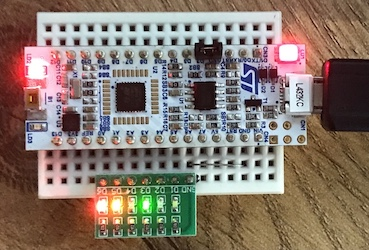

This is a set of low-level "smoke" tests for the build, board, and basics.  
There is no dependency on anything other than PyInvoke and PlatformIO.  
No Monty headers, libraries, or scripts are used here, only Hall & Boss.

Things to try:

```text
inv -l
inv t0
inv t1
inv t2
...
inv t9
```

For tests `t1` and up, a Nucleo-L432KC board needs to be plugged into USB.

## Test `t9`

This last test uses 6 additional LEDs, connected to the Nucleo's A0..A5 pins:



A6 is tied to GND, and each LED has a current-limiting resistor in series.  
_Note that A0..A6 ≠ PA0..PA6, the Nucleo's pin mapping & naming is irregular._
